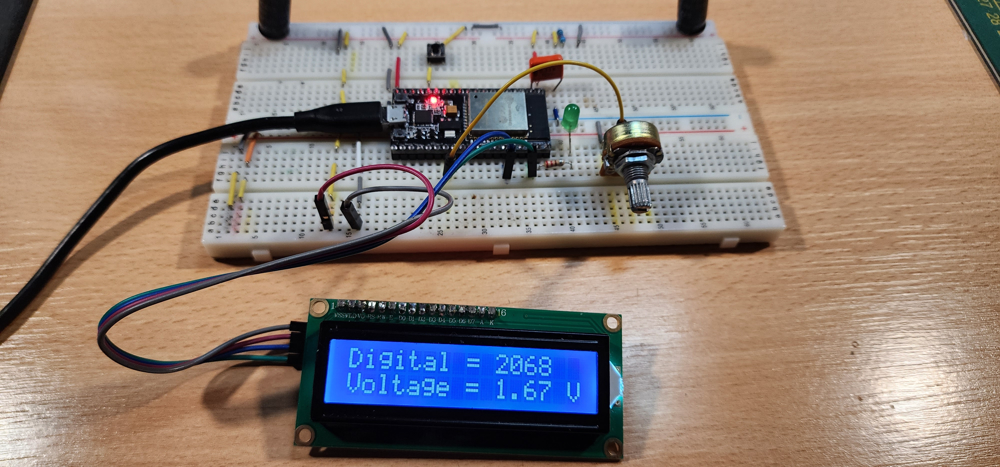

#   Project 09-lcd-8574

    Electronica Digital - Austral 2023 - EAM
    
##   Interfacing LCD 16x2 Display to ESP32 using I2C

    Using ESP32 development board

### Hardware

    1 16x2 LCD display with 8574 i2c board
    1K to 10K potentiometer
    Jumper wires

###  Connections

    Connect potentiometer ends between GND and 3.3 volt
    Connect potentiometer cursor to GPIO "ANAIN" (see platformio.ini)

    Connect 8574 board GND to GND
    Connect 8574 board VCC to 5 Volt
    Connect 8574 board SCL to ESP32 GPIO22
    Connect 8574 board SDA to ESP32 GPIO21

###  Verification

    After splash screen, verify that display shows digital conversion of potentiometer value
    and converted voltage as potentiometer is rotates

### Photos

 

###  Links

 This is the first project using i2c communication; as such, it is very important to read following link;

 [ESP32 I2C Communication: Set Pins, Multiple Bus Interfaces and Peripherals](https://randomnerdtutorials.com/esp32-i2c-communication-arduino-ide/)

 [Interfacing I2C LCD with ESP32](https://www.electronicshub.org/esp32-i2c-lcd/)

### Videos

 [Interfacing 16x2 LCD module with ESP 32- Quick Tutorial.](https://www.youtube.com/watch?v=8zwhOCB9mQE)

